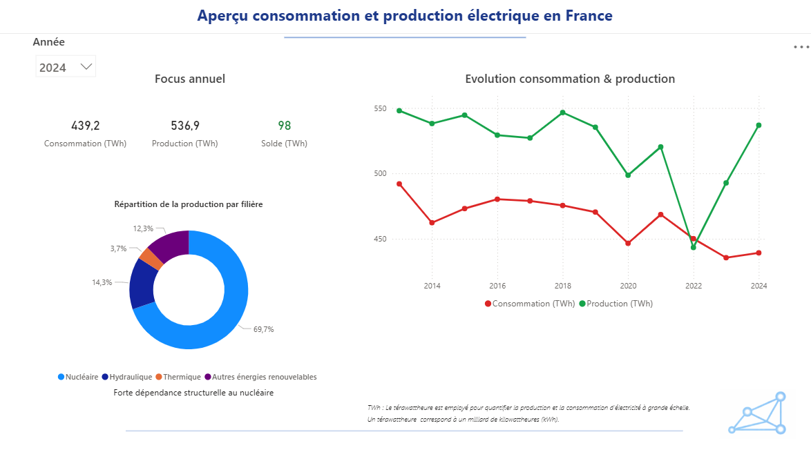
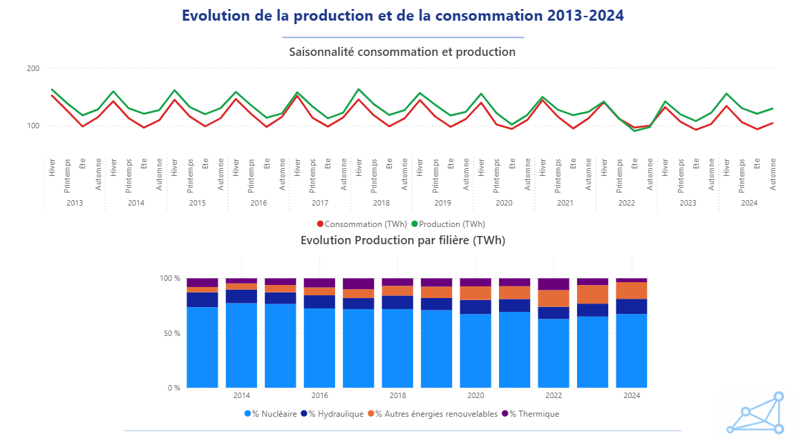
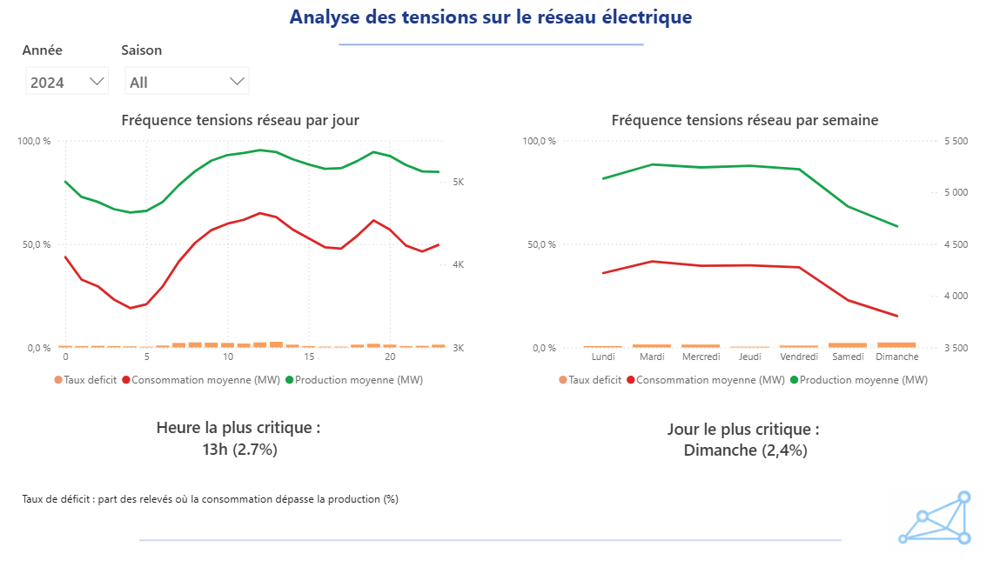

# Analyse du système électrique français

Projet d’analyse de données énergétiques spatio-temporelles réalisé avec Python et Power BI afin d’étudier les dynamiques de production et de consommation d’électricité en France entre 2013 et 2024.

Le projet permet d’identifier les tensions du réseau électrique, les vulnérabilités énergétiques régionales et les périodes critiques du système à partir de plus de 2,5 millions de données issues du réseau de transport d’électricité.

---

# Contexte métier

Dans un contexte de transition énergétique et d’augmentation des besoins électriques, le maintien de l’équilibre entre production et consommation constitue un enjeu stratégique pour la stabilité du système électrique français.

Les variations saisonnières de la demande, les disparités régionales de production ainsi que la dépendance de certains territoires aux importations énergétiques peuvent générer des tensions sur le réseau électrique.

L’analyse des dynamiques énergétiques permet ainsi d’identifier les vulnérabilités territoriales et les périodes critiques du système afin d’améliorer la compréhension des enjeux énergétiques nationaux.

---

# Problématique

Comment exploiter des données énergétiques massives afin :

- d’identifier les tensions du réseau électrique ;
- d’analyser les déséquilibres entre production et consommation ;
- d’évaluer l’autonomie énergétique régionale ;
- de mettre en évidence les vulnérabilités énergétiques territoriales ;
- et de transformer des données complexes en outils d’aide à la décision ?

---

# Solution proposée

Développement d’un dashboard interactif Power BI permettant :

- l’analyse temporelle de la production et de la consommation d’électricité ;
- l’identification des périodes critiques du réseau électrique ;
- l’analyse du mix énergétique régional ;
- l’évaluation de l’autonomie énergétique des régions françaises ;
- l’identification des territoires les plus dépendants des importations d’électricité.

---

# Données utilisées

## Source des données
- RTE(Réseau de transport d'électricité) – éCO2mix (Open Data)

## Caractéristiques du dataset
- Période étudiée : 2013 – 2024
- Plus de 2,5 millions de lignes
- Données énergétiques régionales et nationales
- Données de production et consommation d’électricité
- Analyse spatio-temporelle

## Variables étudiées
- Consommation électrique
- Production totale
- Production nucléaire
- Production hydraulique
- Production thermique
- Production renouvelable
- Solde énergétique
- Taux de couverture énergétique

---

# Technologies utilisées

- Python
- Pandas
- Power BI
- DAX
- Data Visualisation
- Analyse exploratoire des données

---

# Analyses réalisées

- Analyse temporelle de la consommation et de la production
- Analyse de la saisonnalité énergétique
- Étude des tensions du réseau électrique
- Analyse du mix énergétique régional
- Analyse de l’autonomie énergétique
- Identification des vulnérabilités énergétiques territoriales
- Analyse des disparités régionales

---

# Dashboard Power BI

## Vue globale du système électrique



---

## Saisonnalité production et consommation



---

## Analyse des tensions du réseau électrique



---

## Structure du mix énergétique régional


---

## Autonomie énergétique régionale


---

## Vulnérabilité énergétique régionale


---

# Principaux résultats

- Le système électrique français reste globalement équilibré malgré certaines années atypiques comme 2022.
- Les tensions réseau apparaissent principalement en hiver et lors des périodes de forte consommation.
- L’autonomie énergétique varie fortement selon les régions françaises.
- Certaines régions présentent une forte dépendance aux importations d’électricité.
- Le mix énergétique régional influence fortement les niveaux d’autonomie énergétique.

---

# Impacts mesurables

- Identification des périodes critiques du réseau électrique
- Visualisation des disparités énergétiques régionales
- Mise en évidence des territoires énergétiquement vulnérables
- Transformation de données complexes en indicateurs d’aide à la décision
- Production d’analyses exploitables pour la compréhension des enjeux énergétiques

---

# Limites
- Absence de variables météorologiques détaillées
- Analyse principalement descriptive et non prédictive
- Les indicateurs régionaux ne reflètent pas toujours les dynamiques locales fines

---

# Perspectives

- Développement de modèles prédictifs de tension réseau
- Intégration de données météorologiques
- Analyse des émissions carbone associées au mix énergétique
- Développement d’indicateurs de résilience énergétique
- Analyse temps réel des déséquilibres énergétiques

---

# Structure du projet

```text
analyse-systeme-electrique-francais/
│
├── data/
├── images/
├── notebooks/
├── powerbi/
├── README.md
└── requirements.txt
